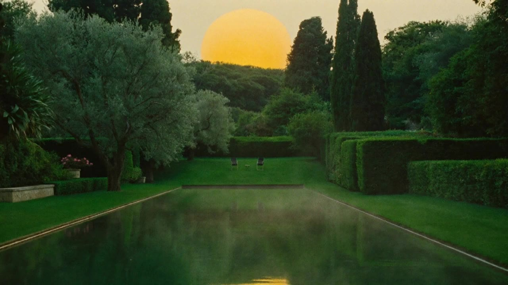

# Blissful Gardenz

An editorial marketing site for a relationship-enrichment practice: private "harmony conversations," a film library, a book trilogy, and a couples membership. The brief was to make a small wellness brand feel like a place you want to stay, so the whole site is built around one idea, a garden at golden hour, and every interaction is tuned to feel calm rather than clever.

**Live:** https://blissfulgardenz.vercel.app



---

## Why this project is worth a look

Most marketing sites are a hero, three feature cards, and a footer. This one tries to earn its pixels. The three pieces I'd point an engineer at:

1. **A scroll-scrubbed video hero.** The opening shot is a 10-second cinematic flythrough of the garden whose playhead is bound to scroll position. You scroll, the film advances; the section stays pinned until the flight finishes, then releases into the page. Getting this smooth is the whole trick (see below).
2. **A real dual-theme token system,** not a `dark:` prefix sprinkle. Dawn and Dusk are two fully-specified palettes resolved before first paint, every contrast pair verified against WCAG AA, and a dedicated ivory token pair for the permanently-dark green surfaces.
3. **A motion system with a vocabulary,** where different kinds of content enter in different ways on purpose, and every animation has a designed reduced-motion fallback so nothing ever ships blank.

## The scroll-scrubbed hero, in detail

The naive version of "video plays on scroll" janks badly, because seeking an H.264 file to an arbitrary timestamp is expensive when frames depend on distant keyframes. Two things fix it:

- **All-keyframe encode.** The hero clip is re-encoded with `-g 1` (every frame a keyframe) so any `video.currentTime = x` seek is effectively instant. That trades file size for seek latency, which is the right trade for a scrubbed hero. Desktop gets the 720p encode; phones get a 540p encode swapped in under `(max-width: 767px)` via a `<source media>` query, so they pull a third of the bytes.
- **Scroll drives the playhead, not React state.** A GSAP `ScrollTrigger` maps scroll progress onto `currentTime` in an `onUpdate` callback, outside the React render cycle, so there is no per-frame re-render. The viewport-sized stage is held with `position: sticky` rather than a GSAP pin, which keeps it immune to the transformed route-transition wrapper (a pinned element inside a `transform`ed ancestor breaks) and to React StrictMode double-mounting. Scrub is gated to fine-pointer, wide-viewport, motion-allowed visitors; touch and reduced-motion visitors get the same film as a calm autoplay loop instead.

The poster frame is server-rendered and the video is a progressive enhancement: the page checks for the encoded file on disk at build time and only wires up the scrub if it exists, so the hero is never a blank rectangle while bytes load.

## Design system

Everything visual is governed by one documented design system that the components are written against, rather than the other way round.

- **Color.** Deep garden green (`#0F2E22`) as the primary, ivory canvas, one gold accent, and nothing else. Two complete themes (Dawn / Dusk) expressed as CSS custom properties. A blocking inline script in `<head>` resolves the theme from `localStorage` then `prefers-color-scheme` before the first paint, so there is no flash. Muted text on the dark-green grounds uses a theme-aware `--brand-ink-muted` token instead of `rgba(white)`, which keeps it off pure white and lets it shift correctly between themes.
- **Type.** Bodoni Moda for display (loaded with its optical-size axis so wordmark-scale headings get the high-contrast cut), Instrument Sans for UI, Newsreader for long-form. All via `next/font`, self-hosted, `font-display: swap`.
- **Motion.** GSAP owns scroll pinning and scrubbing; Motion (Framer) owns in-view reveals and the magnetic CTA physics; they never share a component tree. The reveal vocabulary is deliberately varied: display headings rise out of an overflow mask, photographs unveil behind a lifting clip-path, primary buttons lean toward the cursor (capped at 6px, pointer devices only). Entrance choreography runs in pure CSS so a stalled JS ticker on a backgrounded tab can never strand a headline invisible.
- **Discipline.** One accent color, one corner-radius scale, eyebrows rationed to one per three sections, zero em-dashes anywhere in copy. These are enforced by review, not vibes.

## Accessibility and performance

- WCAG 2.2 AA contrast on body text, verified by computing the ratios for every real foreground/background pair rather than eyeballing them.
- `prefers-reduced-motion` honored everywhere: parallax, scrub, magnetic physics, and staggered reveals all collapse to instant or fade.
- Keyboard paths throughout: visible `focus-visible` rings, a focus-trapped full-screen menu that returns focus to its trigger on close, `aria-expanded` on disclosures.
- Touch targets at 44px minimum; the scrollbar gutter is compensated when the menu locks scroll so the page never shifts sideways.
- Static prerendering for content routes, `next/image` with explicit dimensions, and preloaded fonts, so the hero is paint-ready fast and layout shift stays near zero.

## Tech stack

| Area | Choice |
|---|---|
| Framework | Next.js 16 (App Router, React Server Components) |
| Language | TypeScript (strict) |
| UI | React 19 |
| Styling | Tailwind CSS v4 (CSS-first config, custom-property tokens) |
| Motion | GSAP + ScrollTrigger, Motion (Framer) |
| Primitives | Base UI (accordion), shadcn-style owned components |
| Icons | Phosphor |
| Media | Higgsfield-generated film and stills, re-encoded with FFmpeg |
| Hosting | Vercel |

Server Components render the static layout; anything with scroll, pointer, or theme state is an isolated `"use client"` leaf. Content lives as typed objects under `content/` so the whole thing is a straight lift into a CMS later without touching components.

## Running it locally

```bash
npm install
npm run dev        # http://localhost:3000
```

```bash
npm run build      # production build
npm run start      # serve the build
npm run lint       # eslint (next config)
npx tsc --noEmit   # typecheck
```

Node 20+. The hero video files live in `public/videos/`; if they are absent the hero falls back to its poster frame automatically, so the app runs without them.

## Project structure

```
app/
  (public)/            route group: home, about, conversations, books, watch, journal, membership, legal
  layout.tsx           fonts, metadata, pre-paint theme bootstrap
  globals.css          token sheet (Dawn/Dusk), type scale, motion keyframes
components/
  garden/              design system: header, footer, buttons, reveals, theme toggle, primitives
  home/                hero (scroll-scrub), pillar band, trilogy shelf, blossom wall
  conversations/  membership/  watch/  books/  about/
content/               typed content model (site, offerings, library, books)
```

## Status

Phase 1 of a planned CMS-backed build. The content model is shaped to match the eventual Sanity document types, so the migration is data entry rather than a rewrite. Copy and imagery on interior pages are placeholders pending the client's own assets; the design system, motion, and accessibility work are production-grade.

## License

All rights reserved. Portfolio / demonstration use.
